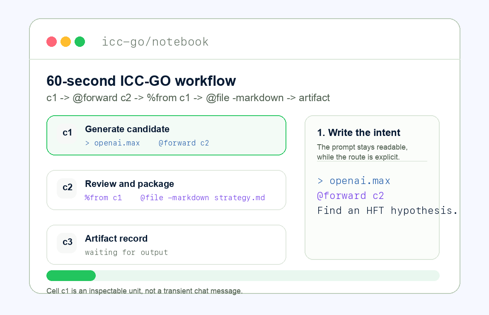

# ICC-GO

Local-first notebook for reproducible LLM workflows written as intent cells.



Install: `npm install && npm run dev`

Three-cell example: `c1` drafts a product spec, `c2` critiques it with `%from c1`, and `c3` exports `final_spec.md`.
Why this exists: chat is transient; ICC-GO is reproducible; cells are inspectable; outputs become addressable artifacts; local-first, BYOK.

## Quick Start

```bash
npm install
npm run dev
```

## Three-cell example

```icc
# c1
> openai.max
@forward c2
@text <700

Draft a product spec for a lightweight issue triage assistant.
Include target users, core workflow, data boundaries, and non-goals.

# c2
> claude.max
@forward c3
@text <600

Critique %from c1.
Identify missing requirements, ambiguous scope, privacy risks, and launch blockers.

# c3
> openrouter:openrouter/auto
@file -markdown final_spec.md

Rewrite the product spec using %from c1 and %from c2.
Produce a concise Markdown file with assumptions, user flows, acceptance criteria, and open questions.
```

## Why Not Just Use ChatGPT, Claude, or Cursor?

- Chat threads are good for conversation, but they are weak as durable workflow records.
- ICC-GO keeps routing, constraints, references, notes, outputs, and artifacts in cells that can be rerun and inspected.
- Prior outputs become addressable inputs through `%from cN` and generated files through `%file.cN:name.ext`.
- The baseline product is local-first and BYOK, so provider keys and notebook data are not bundled into a hosted black box.
- Cursor is excellent for code editing; ICC-GO is for repeatable model workflows that may include code, documents, images, and branching.

## Example Notebooks

Ready-to-read ICC notebooks live in [examples](examples):

- [multi_model_hypothesis.icc](examples/multi_model_hypothesis.icc)
- [contract_review_with_notes.icc](examples/contract_review_with_notes.icc)
- [code_generation_to_files.icc](examples/code_generation_to_files.icc)
- [hft_strategy_branching.icc](examples/hft_strategy_branching.icc)
- [image_and_markdown_artifacts.icc](examples/image_and_markdown_artifacts.icc)

## Roadmap

Now:

- Local-first notebook workspace.
- ICC DSL v1.04.
- Provider keys and alias routing.
- Generated artifacts and addressable references.

Next:

- Connector cells for external tools and data.
- Durable artifact storage.
- Migration tool for older ICC syntax.
- Domain packs with reusable examples and checks.

## Intent-Cell Coding

Intent-Cell Coding is the approach behind ICC-GO: each notebook cell captures a user intent, the provider/model routing, hard execution constraints, flow logic, reusable references, parsed output variables, and generated artifacts. The cell is not just a prompt or a chat message; it is a reproducible unit of intent that can be rerun, inspected, branched, and composed into a workflow.

Read more in [docs/intent-cell-coding.md](docs/intent-cell-coding.md).

## ICC DSL Reference

The ICC DSL command reference lives in [docs/commands.md](docs/commands.md). Keep it updated whenever the notebook gains a new command, reference type, output channel, status, or execution behavior.

## What Is Included

- White, lightweight notebook interface inspired by Jupyter, LibreChat, ChatGPT, and modern writing/coding canvases.
- Left sidebar with projects and notebooks.
- Notebook cells with unified ICC source, prompt/code body, output, metadata, and run history.
- Top workspace bar with File/Edit/Insert/Run/View/Tools/Help menus.
- Autosave, manual save status, snapshots, notebook undo/redo, import, and export.
- Export to `.iccgo.json`, Markdown, or ZIP with notebook state, run history, snapshots, and artifacts.
- Compact and expanded cell modes for larger workflows.
- ICC DSL v1.04 parsing for `>`, `<`, `@if`, `@forward`, registered `@file -format`, `@image`, `@text`, and `%` references such as `%from c2`, `%from c2.pnl`, `%error.c2.message`, and `%file.c3:name.ext`.
- Cell statuses: `not_run`, `running`, `completed`, `partial_failed`, `skipped`, `stale`, `parse_error`, `reference_error`, `decision_error`, `config_error`, and `artifact_error`.
- Strict `@if` decisions over parsed output variables from key-value lines or JSON.
- Cell actions: run, run from here, stop, duplicate, delete, move, collapse, copy output, copy reference.
- Notebook actions: run all, run stale cells, validate, estimate cost, find/go to cell, clear outputs, and copy Markdown.
- Right inspector for parsed DSL, execution plan, inputs, outputs, variables, artifacts, errors, metrics, and history.
- Output artifacts with local immutable records, versioning, icons, viewer, copy/download actions, and prompt/header insertion.
- Settings page with addable provider keys, routing aliases, OpenRouter support, fallback ordering, masked key fields, model profiles, balance warnings, and orchestration selector models.
- Local persistence in `localStorage` for fast local iteration.
- Unit tests for DSL/runtime behavior and Playwright e2e tests for critical editor interactions.

## Commands

```bash
npm install
npm run dev
npm run build
npm run test
npm run test:e2e
npm run test:all
```

## Direction

The intended production shape is:

```text
React notebook UI
  -> API backend
  -> ICC DSL parser and validator
  -> execution planner
  -> workflow runtime and queue
  -> provider adapters
  -> artifacts, run history, secrets, telemetry
```

Provider execution uses a bound key when the selected adapter is available. If an adapter, renderer, or image executor is missing, ICC-GO reports the missing capability before or during the run instead of silently pretending the artifact was created.

## Current Notes

The current notebook uses ICC DSL v1.04 through `src/language/latest`. Encrypted secret storage, durable artifact storage, queues, richer streaming, collaboration, and Git integration should move behind an API backend in later production milestones.
